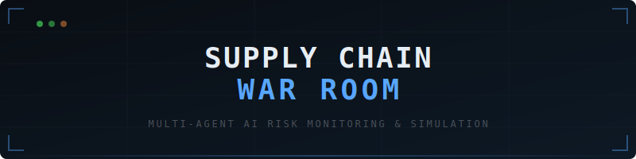
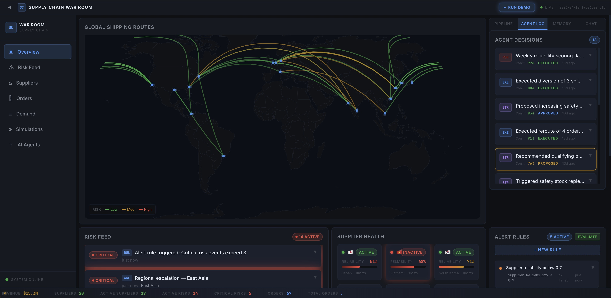
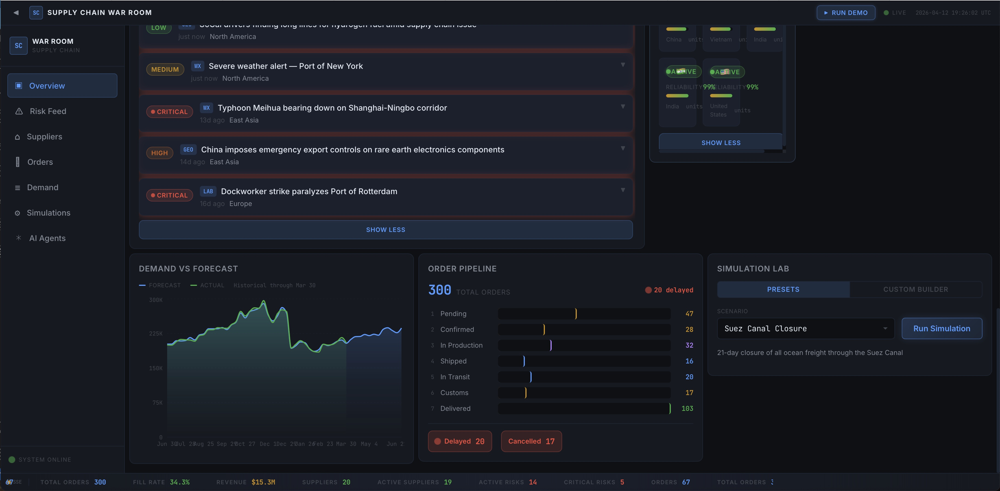

<p align="center">
  
</p>

<h1 align="center">Supply Chain War Room</h1>

<p align="center">
  <strong>Multi-agent AI system for real-time supply chain risk monitoring, Monte Carlo simulation, and autonomous decision-making.</strong>
</p>

<p align="center">
  <a href="#quick-start">Quick Start</a> &middot;
  <a href="#features">Features</a> &middot;
  <a href="#architecture">Architecture</a> &middot;
  <a href="#demo-mode">Demo Mode</a> &middot;
  <a href="#tech-stack">Tech Stack</a>
</p>

<p align="center">
  
  
  
  
  
</p>

---

> Built with the Claude Agent SDK, five specialized AI agents collaborate to monitor a global supply chain, detect emerging risks, run Monte Carlo simulations, propose cost-optimized mitigations, and execute decisions -- all through a command-center dashboard with conversational AI.        

---

## Screenshots

<p align="center">
  
  <br />
  <em>Command center: global shipping routes, agent decisions with full audit trail, and custom alert rules engine</em>
</p>

<p align="center">
  
  <br />
  <em>Risk feed with live alerts, demand vs forecast charts, order pipeline, supplier health, and Monte Carlo simulation lab</em>
</p>

---

## Features

### Core Intelligence

| Feature | Description |
|---------|-------------|
| **Real-time Risk Monitoring** | AI agents scan for disruptions -- port closures, supplier delays, demand spikes, geopolitical events. GDELT news + Open-Meteo weather ingestion with relevance filtering. |
| **Monte Carlo Simulation** | 10,000-iteration what-if scenarios with full statistical output (p50/p90/p95/p99). Real NumPy computation, not LLM-generated numbers. |
| **Custom Scenario Builder** | Compose disruptions: route closures, capacity reductions, node shutdowns, demand spikes, cost surges. Set severity, duration, and affected regions. |
| **Multi-Scenario Comparison** | Run 2-5 scenarios and compare side-by-side: ranked metrics table, radar chart risk profiles, overlapping cost/delay distribution curves. |
| **AI-Powered Strategy** | Agents generate mitigation plans with cost-benefit analysis, alternative suppliers, and rerouting options. |
| **Executive Summary** | After any simulation, generate a boardroom-ready brief with disruption analysis, Monte Carlo results, agent recommendations, and ROI calculations. 3-tier LLM fallback (Claude > Gemma > template). |

### Agentic Capabilities

| Feature | Description |
|---------|-------------|
| **Human-in-the-Loop Approval** | Execution agent requires explicit approval before acting. Approve/reject with glow effects and state machine validation. |
| **Decision Audit Trail** | Every agent action logged with full reasoning, confidence score, cost/time impact, affected orders, and timeline. Expand any decision to see the complete chain. |
| **Agent Handoff Visibility** | Watch the orchestrator delegate to specialists in real-time. Animated pipeline view shows risk monitor -> simulation -> strategy -> execution flow. |
| **Agent Memory & Learning** | Agents store lessons from past decisions and recall them in similar situations. "Last time we faced a port closure in East Asia, rerouting via HCMC saved $400K." Effectiveness tracked over time. |
| **Custom Alert Rules** | Define threshold-based rules (e.g. "supplier reliability < 0.7") that auto-evaluate after every ingestion cycle. Fires risk alerts and optionally triggers agent analysis. |
| **Conversational Interface** | Ask agents anything: "Why did you reroute PO-2025-0042?" and get the full reasoning chain. |

### Demo & Presentation

| Feature | Description |
|---------|-------------|
| **Demo Mode** | One-click guided walkthrough auto-plays a scenario end-to-end: triggers disruption, risk feed lights up, agents deliberate, simulation runs, mitigation gets proposed. |
| **14-Panel Dashboard** | World map, risk feed, supplier grid, order tracker, demand chart, agent log, agent memory, alert rules, simulation lab, chat panel, agent pipeline, scenario builder, executive summary, scenario comparison. |

---

## Architecture

```
┌──────────────────────────────────────────────────────────────────┐
│                      Frontend (React + TypeScript)                │
│                                                                  │
│  GlobalMap  RiskFeed  SupplierGrid  OrderTracker  DemandChart    │
│  AgentLog  SimPanel  ChatPanel  AgentPipeline  ScenarioBuilder   │
│  ExecutiveSummary  ScenarioComparison  DemoOverlay               │
└──────────────────────────────┬───────────────────────────────────┘
                               │ SSE (real-time) + REST API
┌──────────────────────────────┴───────────────────────────────────┐
│                      Backend (FastAPI)                            │
│                                                                  │
│  REST Endpoints ─── Agent Bridge (Claude SDK) ─── SSE Broadcast  │
│        │                    │                                    │
│    Services            Orchestrator                              │
│        │           ┌───────┴──────────────────┐                  │
│   PostgreSQL       │  Risk     Simulation     │                  │
│   (SQLite dev)     │  Monitor  Agent          │                  │
│                    │  Strategy  Execution      │                  │
│                    │  Agent     Agent          │                  │
│                    └──────────┬───────────────┘                  │
│                               │                                  │
│                    Monte Carlo Engine (NumPy)                     │
│                    Supply Chain Graph Model                       │
└──────────────────────────────────────────────────────────────────┘
```

### Agent Hierarchy

| Agent | Role | Key Tools |
|-------|------|-----------|
| **Orchestrator** | Routes queries to specialists, chains multi-step workflows | `get_war_room_context`, `query_decision_log`, `recall_similar_decisions`, `record_lesson` |
| **Risk Monitor** | Detects and scores supply chain risks across 5 categories | `query_risk_events`, `score_suppliers`, `create_alert`, `fetch_risk_signals` |
| **Simulation** | Runs what-if Monte Carlo scenarios, interprets distributions | `run_monte_carlo`, `list_preset_scenarios`, `query_network_stats` |
| **Strategy** | Generates costed mitigation plans with alternatives | `query_inventory_status`, `query_alternative_suppliers`, `generate_mitigation_plan` |
| **Execution** | Executes approved actions with full audit trail | `reroute_order`, `trigger_safety_stock`, `update_supplier_status` |

---

## Quick Start

### Prerequisites
- Python 3.12+
- Node.js 18+
- An [Anthropic API key](https://console.anthropic.com/)

### Option 1: Docker Compose (Recommended)

```bash
git clone https://github.com/rhapsodic-legacy/supply-chain-warroom.git
cd supply-chain-warroom
cp .env.example .env
# Edit .env and add your ANTHROPIC_API_KEY

docker-compose up
```

Open http://localhost:5173

### Option 2: Local Development

```bash
# Backend
cd backend
python3 -m venv .venv && source .venv/bin/activate
pip install -e ".[dev]"
python3 -m app.seed.generator    # Seed with synthetic data
python3 -m uvicorn app.main:app --reload --port 8000

# Frontend (new terminal)
cd frontend
npm install
npm run dev
```

Open http://localhost:5173

---

## Demo Mode

Click the **Demo** button in the top bar to launch a guided walkthrough that auto-plays a complete disruption scenario:

1. A Suez Canal closure event is triggered
2. Risk feed lights up with cascading impacts
3. Agents deliberate and propose mitigations in the chat
4. Monte Carlo simulation runs with 10,000 iterations
5. Results appear with cost/delay distributions
6. Mitigation strategy is proposed for human approval

This is designed for portfolio walkthroughs and interviews -- it shows the full system working end-to-end in under 2 minutes.

---

## Try These Prompts

Once running, open the Chat Panel and try:

| Prompt | What Happens |
|--------|-------------|
| "What are the top risks right now?" | Risk Monitor scans active events, scores severity |
| "How reliable are our East Asia suppliers?" | Risk Monitor computes composite risk scores |
| "Simulate a 3-week Suez Canal closure" | Simulation Agent runs 10K Monte Carlo iterations |
| "What if our Shanghai supplier goes down for a month?" | Single-source failure simulation |
| "What should we do about the Rotterdam strike?" | Strategy Agent generates mitigation plan |
| "Run the demand shock scenario" | Tests resilience against 60% demand spike |
| "Execute the rerouting plan" | Execution Agent reroutes orders (after approval) |
| "Why was order PO-2025-0042 rerouted?" | Retrieves full decision chain from audit log |

---

## Tech Stack

| Layer | Technology |
|-------|-----------|
| **AI Agents** | Claude Agent SDK, Claude Sonnet |
| **Backend** | Python 3.12, FastAPI, SQLAlchemy async, Pydantic v2 |
| **Frontend** | React 19, TypeScript, Vite, Tailwind CSS |
| **Simulation** | NumPy Monte Carlo engine (10K iterations < 0.2s) |
| **Charts** | Recharts (bar, area, radar), react-simple-maps |
| **Real-time** | Server-Sent Events (SSE) with broadcast event bus |
| **Database** | PostgreSQL 16 (production) / SQLite (development) |
| **State** | Zustand + TanStack React Query |
| **Testing** | pytest + pytest-cov (backend), Vitest + Testing Library (frontend) |
| **CI** | GitHub Actions: lint, type-check, test, build |

---

## How Simulations Work

The Monte Carlo engine models the supply chain as a directed weighted graph:

```
Supplier ──→ Origin Port ──→ Destination Port ──→ Customer
         ocean/air/rail        cost, capacity,
                               reliability, lead time
```

1. **Baseline** -- Normal operations with stochastic lead times (log-normal distribution)
2. **Disruption** -- Apply scenario effects (route closure, capacity reduction, node shutdown, demand spike, cost surge)
3. **10,000 iterations** -- Vectorised NumPy sampling of lead times, flow, cost, fill rate per path
4. **Statistical output** -- Full distribution stats (mean, std, p50, p90, p95, p99, min, max) + histogram bins
5. **Agent interpretation** -- AI analyzes results and recommends actions with cost-benefit analysis

The math is real NumPy computation -- not LLM-generated numbers.

---

## Synthetic Data

The system ships with a deterministic synthetic data generator -- no external APIs needed:

- **20 suppliers** across 5 regions (East Asia, South Asia, Europe, Americas)
- **25 products** across 4 categories (electronics, automotive, pharma, consumer goods)
- **36 shipping routes** covering major global trade lanes
- **300+ orders** with realistic status distribution and delays
- **3,900+ demand signals** with seasonality, trends, and anomalies
- **23 risk events** including active geopolitical, weather, and logistics scenarios

---

## Testing

```bash
# Backend (11 test files, 3,200+ lines)
cd backend && source .venv/bin/activate
python3 -m pytest tests/ -v --cov=app

# Frontend (11 test files)
cd frontend && npm test
```

CI runs on every push: ruff lint/format, pytest with coverage, TypeScript type-check, Vitest, production build.

---

## Project Structure

```
supply_room/
├── backend/
│   ├── app/
│   │   ├── agents/          # 5 Claude Agent SDK agents + tool implementations
│   │   ├── models/          # 13 SQLAlchemy ORM models
│   │   ├── routers/         # FastAPI route modules
│   │   ├── schemas/         # Pydantic v2 request/response schemas
│   │   ├── services/        # Business logic layer
│   │   ├── simulation/      # Monte Carlo engine, network graph, scenarios
│   │   └── seed/            # Synthetic data generator
│   └── tests/               # pytest suite with mock Anthropic SDK
├── frontend/
│   └── src/
│       ├── components/
│       │   ├── layout/      # WarRoomShell, Sidebar, StatusBar
│       │   ├── panels/      # 14 dashboard widgets
│       │   ├── shared/      # Button, Card, Badge, Modal, Spinner
│       │   └── demo/        # Demo mode overlay + progress
│       ├── hooks/           # TanStack Query data hooks
│       ├── stores/          # Zustand state management
│       ├── types/           # TypeScript interfaces (derived from backend)
│       └── styles/          # Dark theme CSS with glow effects
├── docs/                    # Architecture, dev log, Claude Code showcase
└── docker-compose.yml       # Full-stack deployment (PostgreSQL + API + SPA)
```

---

## Deployment

### Development (hot-reload)

```bash
docker-compose up
# Frontend: http://localhost:5173 (Vite dev server with HMR)
# Backend:  http://localhost:8000 (auto-reload on file changes)
```

### Production (localhost)

```bash
docker-compose -f docker-compose.prod.yml up --build
# App: http://localhost (nginx serves built SPA, proxies to backend)
```

### Cloud Deployment

| Service | Platform | Config | Notes |
|---------|----------|--------|-------|
| **Frontend** | Vercel | `vercel.json` | Set `VITE_API_URL` to your Railway backend URL |
| **Backend** | Railway | `railway.toml` | Add `ANTHROPIC_API_KEY`, attach Railway Postgres addon |
| **Database** | Railway Postgres | Auto-provisioned | Railway provides `DATABASE_URL` automatically |

```bash
# Railway (backend + Postgres)
railway login
railway init
railway add --plugin postgresql
railway variables set ANTHROPIC_API_KEY=sk-ant-...
railway up

# Vercel (frontend)
vercel --prod
# Set env: VITE_API_URL=https://your-app.railway.app
```

---

## Built With Claude Code

This project was built entirely using [Claude Code](https://claude.ai/code):

- **Hierarchical CLAUDE.md** -- Root + backend + frontend convention files
- **6 custom slash commands** -- `/add-agent`, `/gen-scenario`, `/add-dashboard-widget`, `/run-simulation`, `/dev-log`, `/sync-types`
- **Automated hooks** -- Auto-format on save (ruff for Python, prettier for TypeScript)
- **Parallel subagents** -- Frontend and backend built simultaneously
- **Plan mode** -- Architecture design before implementation

See [docs/CLAUDE_CODE_SHOWCASE.md](docs/CLAUDE_CODE_SHOWCASE.md) for the full development workflow.

---

## License

MIT
